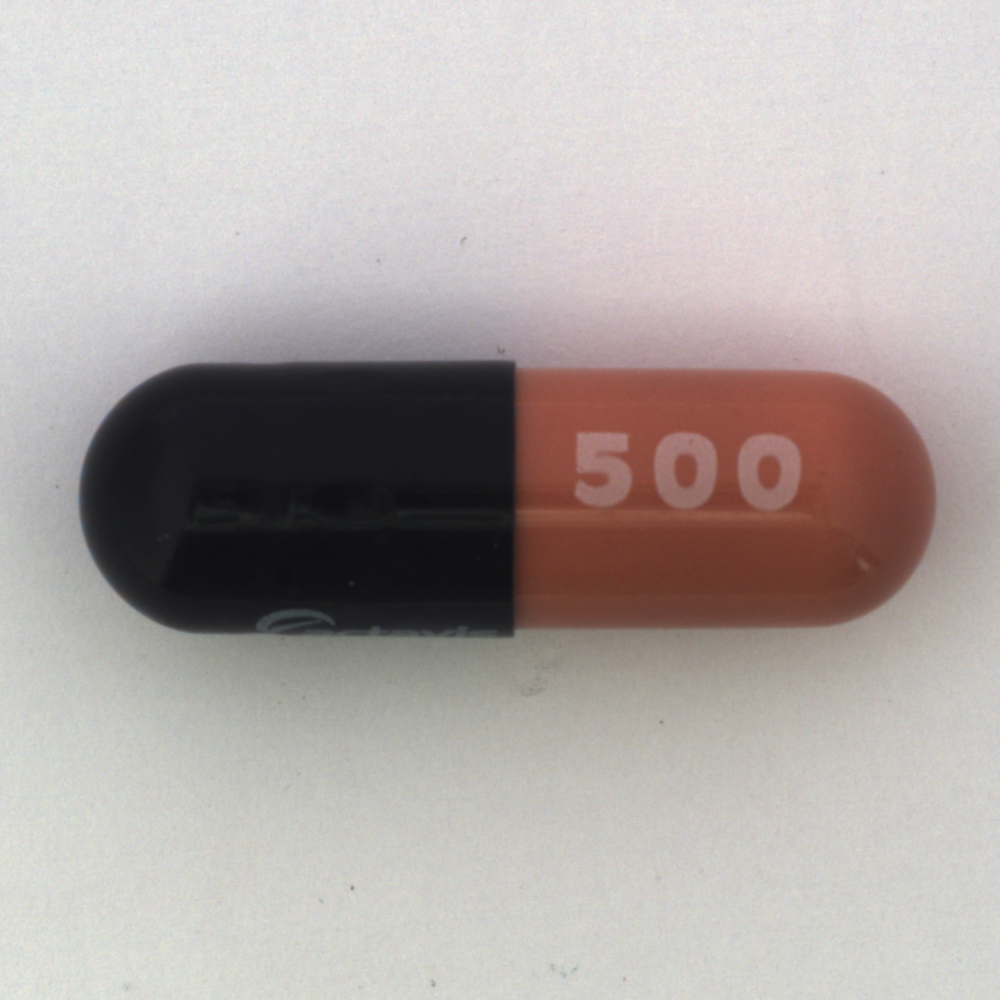
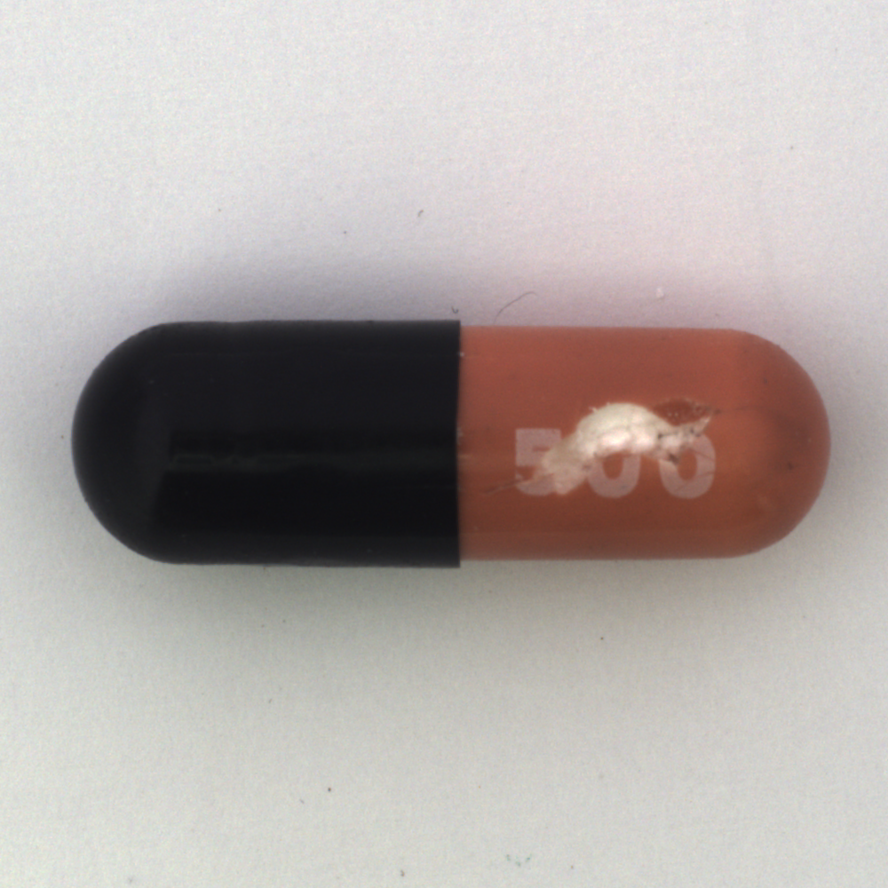
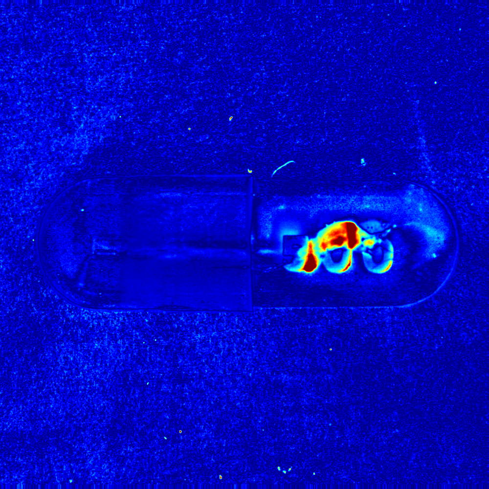
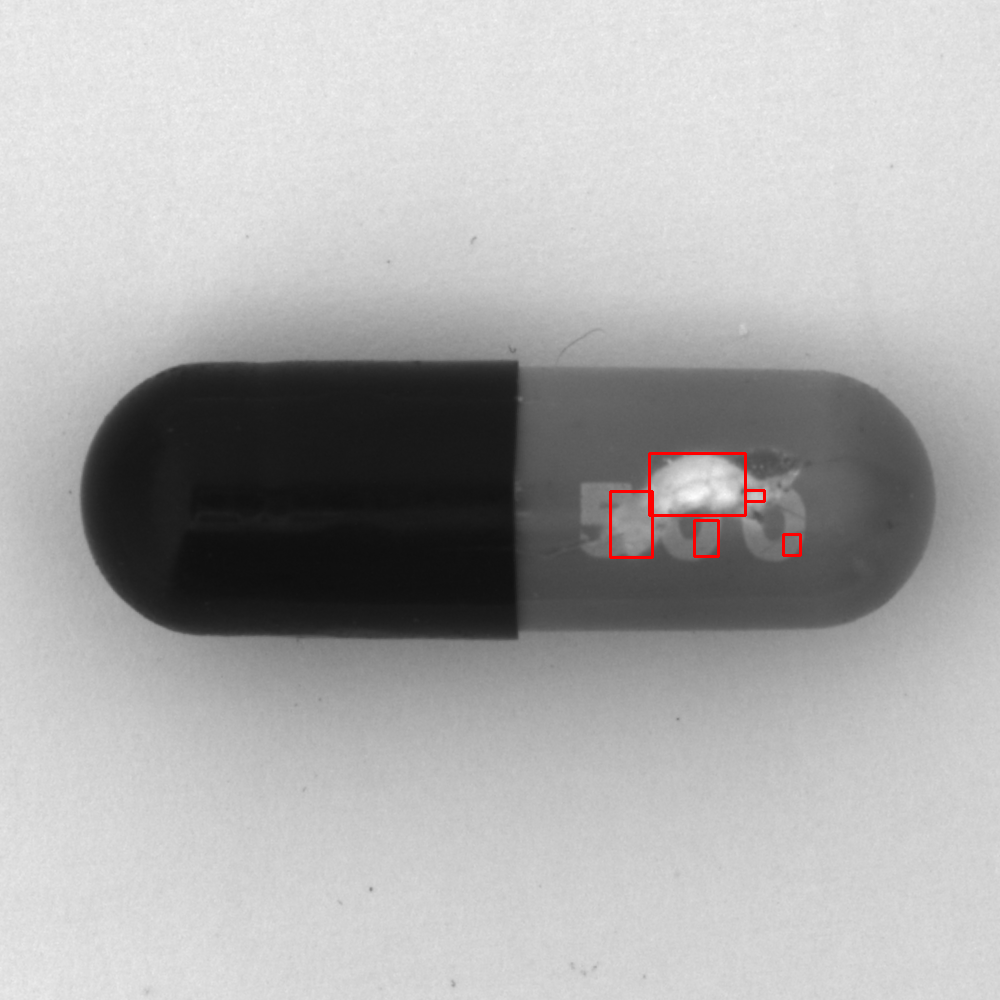

# Computer Vision — 표면 결함 검출 (Anomaly Detection)

OpenCV(C++) 기반 산업 표면 결함 검출 저장소입니다. 정상 이미지 기반 이상탐지 파이프라인을 구현하고, 파라미터 실험으로 한계를 규명한 뒤 적응형 임계값·정렬로 단계적으로 개선해 보았습니다. 모든 결과는 **MVTec AD** 로 실측했습니다.

## 예시

| 정상 | 결함(찍힘) | Z-score 히트맵 | 검출 결과 |
|:---:|:---:|:---:|:---:|
|  |  |  |  |

정상 평균에서 벗어난 정도(Z-score)를 색으로 나타낸 것이 히트맵입니다 — 결함 부위가 붉게 뜨고 정상 배경은 파랗습니다. 이를 임계·정리한 뒤 결함 영역을 박스로 표시합니다. (v3, MVTec AD capsule/poke)

## 프로젝트 구성

| 프로젝트 | 내용 |
|---|---|
| [**AnomalyDetection-cpu-baseline**](AnomalyDetection-cpu-baseline) (v1) | 정상 평균(골든 이미지) 차분 기반 CPU 파이프라인 + 파라미터 실험 |
| [**AnomalyDetection-adaptive**](AnomalyDetection-adaptive) (v2) | 픽셀별 표준편차(σ) 기반 적응형 임계값(Z-score) |
| [**AnomalyDetection-registration**](AnomalyDetection-registration) (v3) | 차분 전 ECC 정렬 추가 — 정렬 오차의 영향 검증 |

파이프라인: `정상 평균 → 차분(absdiff) → 블러 → 이진화 → 모폴로지 → 연결요소`
지표: **과검**(정상을 결함이라 함) / **미검**(결함을 놓침), 폴더별 집계. 원본 수치는 각 프로젝트 `experiments/` CSV.

## 결과 요약

MVTec AD capsule · 정상 219장 학습 → test 132장(정상 23 / 결함 109) · Intel i5-6600, MSVC Release x64.
동작점(threshold·k)에 따라 과검↔미검이 반대로 움직이므로, **미검을 같은 수준(~2 %)으로 맞춘** 뒤 과검(정상 오검)을 비교합니다. 전체 곡선은 각 프로젝트의 실험 CSV 참고.

| | 동작점 | 과검(정상 오검) | 미검(결함 놓침) | 처리시간 |
|---|---|---:|---:|---:|
| v1 고정 임계값 | threshold=30 | 91.3 % (21/23) | 1.8 % (2/109) | ~7.5 ms |
| v2 적응형(Z-score) | k=2.5 | 82.6 % (19/23) | 1.8 % (2/109) | ~23 ms |
| v3 정렬(ECC) | k=2.5 | 73.9 % (17/23) | 2.8 % (3/109) | ~52 ms |

같은 미검 수준에서 과검이 v1 → v2 → v3 로 낮아졌습니다(91.3 → 82.6 → 73.9 %). 다만 임계를 완화하면(미검 허용) 세 버전 모두 과검이 약 34.8 %에서 더 내려가지 않았습니다.

이 34.8 %는 남은 부분이 알고리즘보다 조명·촬영 조건 쪽에 원인이 있음을 시사합니다. **단일 골든 이미지 차분 방식의 구조적 한계**로, 실무에서는 이 지점부터 광학 조건 개선 또는 학습 기반(딥러닝) 방법이 병행됩니다. 검사 방법마다 촬영 통제 의존도가 다르므로(차분 > 특징 기반 > 학습 기반), 환경에 맞춰 방법을 선택하게 됩니다.

## 기술 스택

- **C++17**, **OpenCV 4.12** (vcpkg `x64-windows`)
- **Visual Studio 2022** (MSVC v143), Release · x64
- 통계(평균·분산)·공간 필터(가우시안·모폴로지)·연결요소 분석

## 데이터셋

[MVTec AD](https://www.mvtec.com/company/research/datasets/mvtec-ad) — CC BY-NC-SA 4.0. 전체 데이터는 **저장소에 포함하지 않습니다.** 위 예시의 원본 이미지(정상·결함)는 MVTec AD capsule에서 발췌했으며, 저작권은 MVTec Software GmbH에 있습니다(비상업 연구 목적 인용).
> P. Bergmann et al., "MVTec AD — A Comprehensive Real-World Dataset for Unsupervised Anomaly Detection," CVPR 2019.
